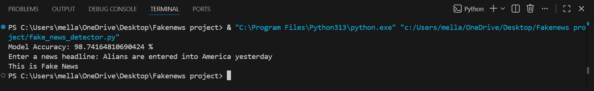

Fake News Detection using Machine Learning

📌 Project Overview

This project aims to detect whether a news article is **Fake or Real** using Machine Learning and Natural Language Processing (NLP).
The model is trained on a dataset containing real and fake news articles and learns patterns in the text to classify them.

🚀 Features

* Preprocesses news text data
* Uses NLP techniques like **TF-IDF vectorization**
* Trains a machine learning model to classify news
* Predicts whether a news article is **Fake or Real**

🛠️ Technologies Used

* Python
* Pandas
* NumPy
* Scikit-learn
* Natural Language Processing (NLP)

📂 Dataset

The dataset used for this project contains two files:

* Fake.csv
* True.csv

Dataset source: Kaggle Fake and Real News Dataset.
⚙️ How the Project Works

1. Load the dataset (Fake and True news).
2. Combine and label the data.
3. Clean and preprocess the text.
4. Convert text into numerical form using **TF-IDF Vectorizer**.
5. Train a machine learning model.
6. Predict whether a news article is fake or real.

▶️ How to Run the Project

1. Clone this repository
2. Install required libraries
3. Run the Python file or Jupyter Notebook

Example:

pip install pandas numpy scikit-learn

Then run the project file.
 📊 Model Used

The project uses a machine learning classification algorithm such as:

* Logistic Regression
  (or whichever model you used)
 📈 Result

The model can classify news articles as **Fake or Real** based on their textual content.

👩‍💻 Author

Jesmitha
## 📊 Output

The trained machine learning model predicts whether a given news article is Fake or Realbased on its textual content.

Example Prediction:
📊 Output

